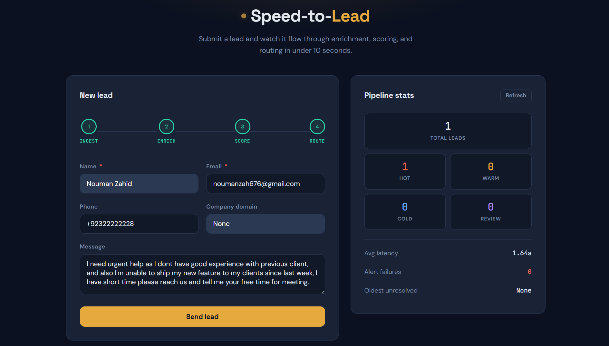
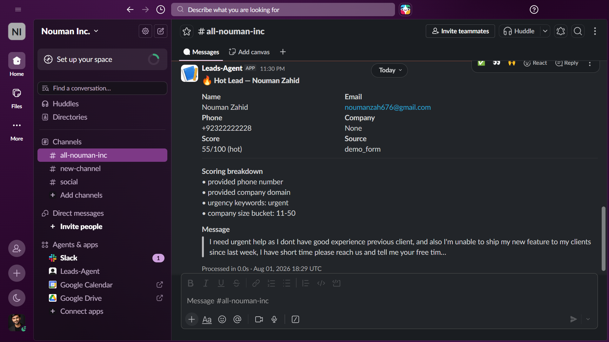
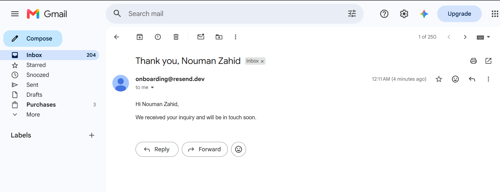
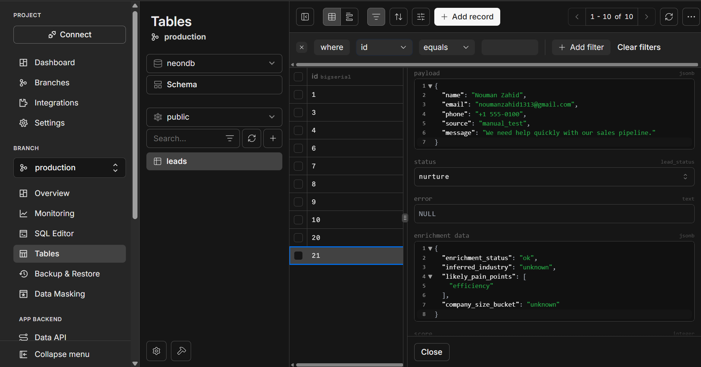

<div align="center">

---

## Why this project exists (Why I choose this problem)

When a potential customer fills out a form on your website, **time is money**.

Research consistently shows that a business that reaches out to a lead within **5 minutes** converts them at _many times_ the rate of one that waits 30 minutes. The problem is that nobody can sit and watch an inbox all day — not a small business owner, not a solo salesperson, not an agency juggling multiple clients.

Most businesses lose hot leads every single week, not because they don't want them, but because:

- Nobody noticed the inquiry for an hour (or a day).
- There was no clear system for "who follows up on this and how fast?"
- The lead was never told apart from spam and low-quality inquiries.

**Speed-to-Lead fixes this.** It watches every lead that comes in — 24/7, for free — and:

1. **Ranks it automatically** (hot / warm / cold) using smart AI enrichment + a transparent scoring system.
2. **Alerts you instantly** — a _hot_ lead pings your **Slack** in seconds so you (or your sales team) can call them while they're still warm.
3. **Nurtures the rest** — a _warm_ lead gets an automatic, personal reply **email** in their inbox, so nobody feels ignored.
4. **Never loses a lead** — even if Slack or the email service is down, nothing silently disappears. Every lead is stored in the database with a status you can see at a glance.

The whole pipeline runs in **under 10 seconds**, end to end.

---

## What it does — at a glance

| Lead type          | Score   | What happens automatically                                                                         |
| ------------------ | ------- | -------------------------------------------------------------------------------------------------- |
| 🔥**Hot**    | 45–100 | Instant**Slack alert** with name, email, phone, score & reasoning — you call them back fast |
| 🟡**Warm**   | 25–44  | Automatic**personal thank-you email** (via Resend) — they feel looked after                 |
| ❄️**Cold** | 0–24   | Quietly stored & tracked — no spam, no wasted attention                                           |

The demo page includes a **live pipeline visualizer** — submit a lead and watch it flow through _Enrich → Score → Route_ in real time.

---

## 📸 See it in action

|                                                                                    |                                                                          |
| :---------------------------------------------------------------------------------: | :----------------------------------------------------------------------: |
| **Demo web app** — lead capture form + live pipeline trace + stats dashboard | **Hot lead alert in Slack** — instant ping with full lead details |
|                                                    |                                        |
|            **Warm lead email** — automatic reply sent via Resend            |       **Neon Postgres** — every lead persisted, never lost       |
|                                              |                                      |

---

## 🏗️ Architecture

```mermaid
flowchart TD
    subgraph Inbound["Any Lead Source"]
        A[["Your website form / API webhook"]]
    end

    subgraph API["FastAPI (async)"]
        B["POST /webhook/lead
        Validate payload
        Deduplicate (idempotency key)
        Respond 200 instantly"]
    end

    subgraph DB[(Neon PostgreSQL)]
        C["leads table
        status: received → enriched → scored → routed / nurture / cold / needs_review"]
    end

    subgraph Pipeline["LangGraph background pipeline (< 10s)"]
        D["🧠 Enrichment
        Groq AI (llama-3.1-8b)
        infers industry, company size,
        pain points"]
        E["⚖️ Scoring
        deterministic rules (0–100)
        hot / warm / cold"]
        F["📤 Routing
        hot → Slack
        warm → email
        cold → store"]
    end

    subgraph Outbound["Notifications"]
        G["🔥 Slack incoming webhook
        (hot lead alert)"]
        H["📧 Resend API
        (warm lead email)"]
    end

    A --> B
    B --> C
    B --> D
    D --> E
    E --> F
    F --> C
    F --> G
    F --> H
```

### What happens step by step

1. **A lead arrives** from any source — the demo form, a website form, or any third-party webhook (the contract is generic).
2. **We acknowledge it instantly** (200 OK) — senders won't time out and retry, so no duplicate leads, ever.
3. **The AI reads the lead** — company domain + message → infers the industry, company size, and likely pain points.
4. **A transparent scoring engine** combines that with signals like "provided a phone number" or "said ASAP" to give a clear 0–100 score. Same lead always gets the same score — no surprises, fully explainable to a client.
5. **Routing** — hot leads hit your Slack instantly; warm leads get a personal email; cold leads are stored quietly.
6. **Nothing gets lost.** Any failure along the way lands the lead in a visible "needs review" state with the reason logged — the stats dashboard shows it.

> 🛡️ **Every external call has a hard timeout, automatic retry with backoff, and a defined fallback.** Slack down? Email down? AI down? Database cold-starting? The system degrades gracefully and never crashes or silently drops a lead.

---

## ✅ What works today (verified & tested)

| Capability                                                     | Status     | How it was verified                                               |
| -------------------------------------------------------------- | ---------- | ----------------------------------------------------------------- |
| Lead ingestion with**duplicate protection**              | ✅ Working | Same webhook sent twice → processed exactly once (tested)        |
| **AI enrichment** (Groq llama-3.1-8b-instant, free tier) | ✅ Working | Industry / company size / pain points inferred per lead           |
| **Deterministic scoring** (hot / warm / cold)            | ✅ Working | 11 automated tests, incl. edge cases & failure degradation        |
| **Slack alerts** for hot leads                           | ✅ Working | Hot lead → formatted alert with score breakdown arrives in Slack |
| **Email via Resend** for warm leads                      | ✅ Working | Warm lead → personal reply email delivered to the lead's inbox   |
| **Neon Postgres persistence**                            | ✅ Working | Every lead stored with status, score & latency; survives restarts |
| **Stats dashboard** (`/stats`)                         | ✅ Working | Live counts by status, average latency, oldest unresolved lead    |
| **$0/month hosting** (Render free + Neon free)           | ✅ Working | Full stack deployed at zero running cost                          |
| **End-to-end speed**                                     | ✅ Working | Pipeline completes in < 10 s, logged per lead                     |

---

## 🧰 Tech stack

| Layer         | Technology                                  | Why                                                                |
| ------------- | ------------------------------------------- | ------------------------------------------------------------------ |
| API           | **FastAPI** (async)                   | Native async → instant webhook acknowledgement, no blocking       |
| Orchestration | **LangGraph**                         | Explicit pipeline graph with per-step error handling & checkpoints |
| AI enrichment | **Groq** — llama-3.1-8b-instant      | Free tier, very fast inference, OpenAI-compatible                  |
| Scoring       | **Pure Python** (deterministic)       | Free, instant, unit-tested, explainable to any client              |
| Database      | **Neon PostgreSQL** (serverless)      | Persistent free tier, scale-to-zero, no data expiry                |
| Notifications | **Slack webhooks** + **Resend** | Free tiers, 5-minute setup, no approval process                    |
| Hosting       | **Render** (free web service)         | $0/month, deploys straight from GitHub                             |

---

## Quick start (local)

### Prerequisites

- Python 3.11+
- A [Neon](https://neon.tech) Postgres database (free tier)
- A [Groq](https://console.groq.com) API key (free tier) — or an OpenAI key
- Optional: a [Slack](https://api.slack.com/messaging/webhooks) incoming webhook and a [Resend](https://resend.com) API key

### Setup

```bash
# 1. Clone & enter
git clone https://github.com/NoumanZahid-85/speed-to-lead.git
cd Speed_to_Lead

# 2. Virtual environment
python -m venv .venv
.venv\Scripts\activate        # Windows
# source .venv/bin/activate   # macOS / Linux

# 3. Install dependencies
pip install -r requirements.txt

# 4. Configure environment
# Copy .env.example to .env and fill in:
#   DATABASE_URL      — your Neon Postgres connection string
#   GROQ_API_KEY      — your Groq key (starts with gsk_)
#   SLACK_WEBHOOK_URL — for hot lead alerts
#   RESEND_API_KEY    — for warm lead emails (use "onboarding@resend.dev" as sender to start)

# 5. Create the database table
psql "$DATABASE_URL" -f migrations/001_create_leads.sql

# 6. Start the server
uvicorn app.main:app --reload --port 8000
```

Open **http://localhost:8000** — submit a test lead and watch the pipeline trace animate.

> **No database? No problem.** If `DATABASE_URL` is missing or unreachable, the app automatically falls back to an in-memory store — everything still works (stats reset on restart).

---

## ☁️ Deploy to Render (free)

1. Push this repo to GitHub.
2. In [Render](https://render.com), create a **Web Service** from the repo — `render.yaml` is already configured (build: `pip install -r requirements.txt`, start: `uvicorn app.main:app`).
3. Set these environment variables in Render: `DATABASE_URL`, `GROQ_API_KEY`, `SLACK_WEBHOOK_URL`, `RESEND_API_KEY`.
4. Done — deploys automatically on every push.

> ⚠️ Free-tier note: Render sleeps after ~15 min of inactivity. The first request after idle takes 30–60 s (wake-up + Neon compute resume). The app is built to survive this — connection-level retries handle it. A paid `starter` plan ($7/mo) removes the sleep entirely.

---

## 🔌 API

| Endpoint          | Method | Description                                                                |
| ----------------- | ------ | -------------------------------------------------------------------------- |
| `/`             | GET    | Demo form with live pipeline trace & stats dashboard                       |
| `/webhook/lead` | POST   | Accept a lead (JSON) — returns instantly, processes in background         |
| `/stats`        | GET    | Pipeline health: counts by status, avg latency, failures                   |
| `/leads`        | GET    | List of all processed leads with their scores, status, and processing logs |
| `/health`       | GET    | Liveness check for Render                                                  |

### Example webhook payload

```json
{
  "name": "Jane Smith",
  "email": "jane@company.com",
  "phone": "+1 555 123 4567",
  "company_domain": "company.com",
  "message": "We need help with this asap",
  "source": "website_form"
}
```

Required: `name`, `email`. Everything else is optional. Sending the same payload twice returns `duplicate_ignored` — your webhook provider can retry safely.

---

## ⚖️ How scoring works (fully transparent)

| Signal                                                    | Points |
| --------------------------------------------------------- | ------ |
| Phone number provided                                     | +15    |
| Company domain provided                                   | +10    |
| Urgency keywords in message ("asap", "urgent", "today"…) | +10    |
| Company size identified by AI                             | +20    |
| Industry inferred by AI                                   | +5     |

- **Hot ≥ 45** → Slack alert · **Warm ≥ 25** → email · **Cold < 25** → stored only
- Score is clamped to 0–100
- If AI enrichment fails, scoring uses only the reliable structured fields — a lead is never unfairly inflated or unfairly ignored because of an AI hiccup

---

## 🧪 Testing

```bash
pytest tests/ -v
```

11 tests covering: deterministic scoring edge cases, AI-failure degradation, score clamping, adapter fallbacks, and human-readable score reasons.

---

## 🗺️ What's NOT included (honest scope + future plans)

This is a deliberately honest list — these are the things v1 intentionally does _not_ do yet, so you know exactly what you're getting:

| Not included in v1                                                     | Why / What's planned                                                                                                                                          |
| ---------------------------------------------------------------------- | ------------------------------------------------------------------------------------------------------------------------------------------------------------- |
| **Meta / Google Lead Ads direct integration**                    | Requires lengthy platform app-review approval. The webhook contract is generic, so plugging a real ads-provider webhook in is a small adapter, not a rewrite. |
| **Multi-tenant SaaS** (client logins, billing, tenant isolation) | v1 is a single-tenant, deploy-per-client model — each client gets their own instance. Auth & billing are a planned phase.                                    |
| **Multi-day nurture drip email sequences**                       | v1 sends one automatic reply email. A drip engine (e.g., follow-up after 24h, 3 days, 7 days) is the natural next phase.                                      |
| **WhatsApp notifications**                                       | Same platform-approval overhead as Meta Ads. Noted as a possible future channel adapter.                                                                      |
| **Celery / Redis distributed task queue**                        | Deliberately replaced with in-process async — correct at this scale and keeps cost at $0. Swap-in ready if a client's volume ever justifies it.              |
| **ML-based scoring**                                             | Current scoring is transparent rules (better for explaining "why" to a client). An ML model trained on real client lead history is a natural v2 upgrade.      |
| **Authentication on the webhook endpoint**                       | v1 endpoints are open (public webhook URL). A secret-token check is a planned hardening step for production use.                                              |
| **Phone / SMS follow-up**                                        | Hot leads are alerted in Slack so_you_ make the call — automated SMS outreach is a future channel option.                                                  |

---

## 📁 Project structure

```
Speed_to_Lead/
├── app/
│   ├── main.py           # FastAPI app + demo UI + startup/shutdown
│   ├── config.py         # Environment settings (Pydantic)
│   ├── database.py       # Postgres connection pool (cold-start resilient)
│   ├── repository.py     # Data layer (Postgres + in-memory fallback)
│   ├── webhooks.py       # POST /webhook/lead — idempotent ingestion
│   ├── enrichment.py     # AI enrichment adapters (Groq / OpenAI / stub)
│   ├── scoring.py        # Deterministic 0–100 scoring engine
│   ├── routing.py        # Delivery: Slack alerts + Resend emails
│   ├── pipeline.py       # LangGraph orchestration (enrich → score → route)
│   ├── stats.py          # /stats health dashboard
│   └── logging_config.py # Structured JSON logging with correlation IDs
├── migrations/           # SQL schema
├── tests/                # 11 passing tests
├── Images/               # Screenshots for this README
├── render.yaml           # One-click Render deployment config
└── requirements.txt
```

---

## 📜 License

MIT — free to use, adapt, and resell.

---

<div align="center">
